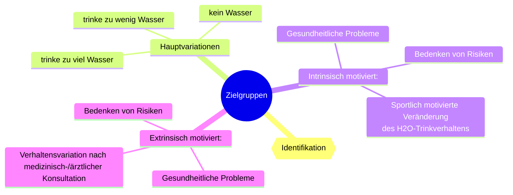

```mermaid
mindmap
    root((Zielgruppen))
            id{{Identifikation}}
            Hauptvariationen
              trinke zu wenig Wasser 
              trinke zu viel Wasser
              kein Wasser 
            
            Intrinsisch motiviert:
                Gesundheitliche Probleme
                Bedenken von Risiken
                Sportlich motivierte Veränderung<br/>des H2O-Trinkverhaltens


            Extrinsisch motiviert:
                Gesundheitliche Probleme
                Verhaltensvariation nach medizinisch-/ärztlicher Konsultation
                Bedenken von Risiken
                
```

