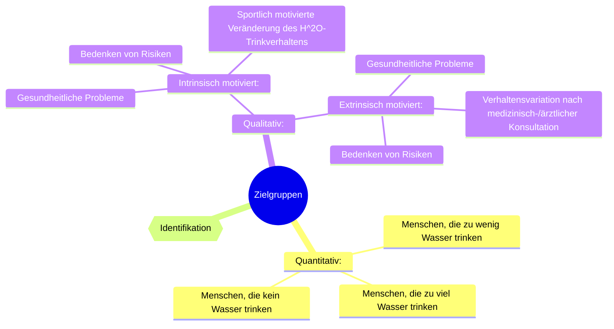
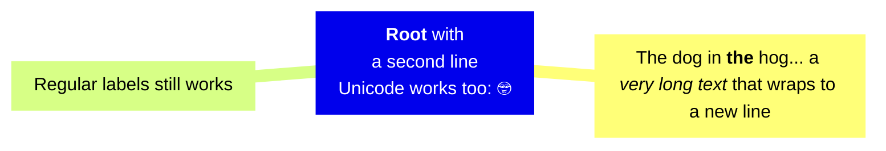

## Appendix (pick 'n drop)

Grobe Unterteilung A (Quantitativ)[^bignote]

    Menschen, die zu wenig Wasser trinken
    Menschen, die zu viel Wasser trinken
    Menschen, die kein Wasser trinken

Grobe Unterteilung B (Qualitativ):

    Intrinsisch motiviert:
        Gesundheitliche Probleme
        Bedenken von Risiken
        Sportlich motivierte Veränderung des H2O-Trinkverhaltens

    Extrinsisch motiviert:
        Gesundheitliche Probleme
        Verhaltensvariation nach medizinisch-/ärztlicher Konsultation
        Bedenken von Risiken

