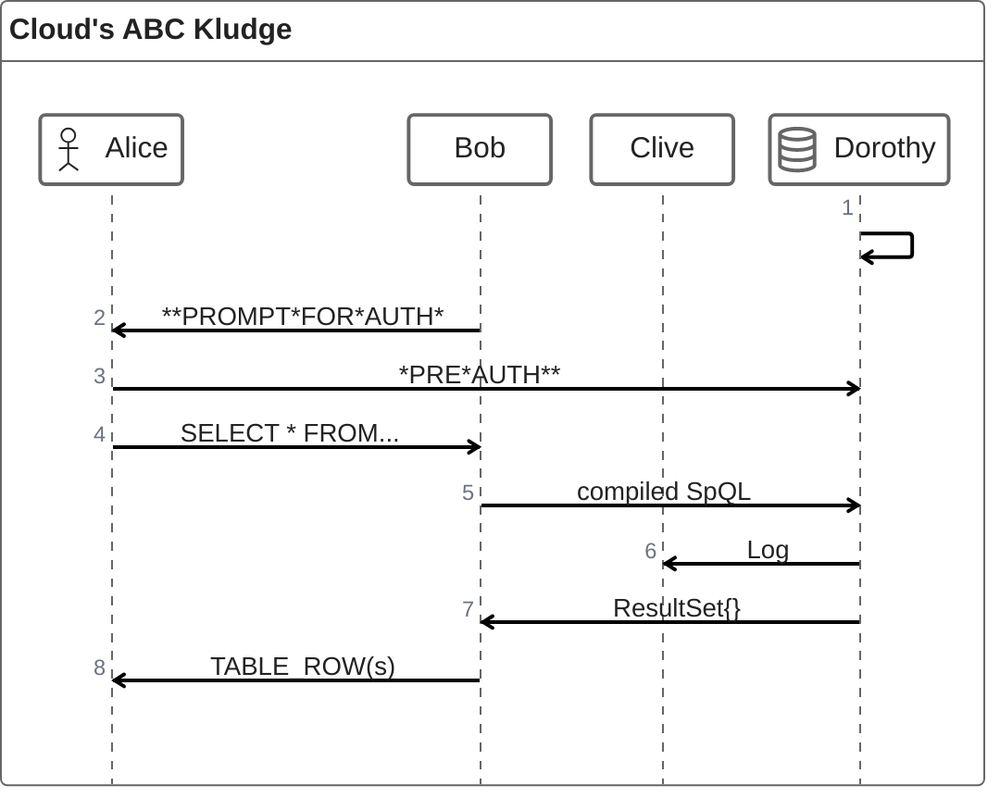
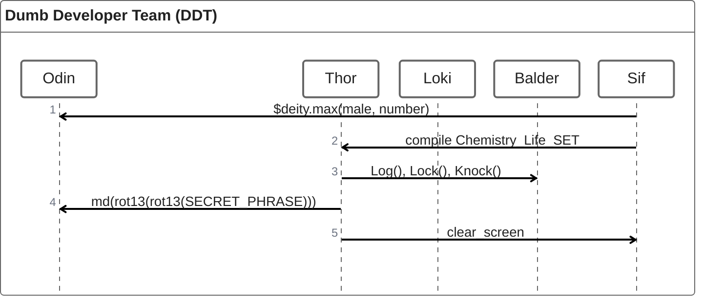
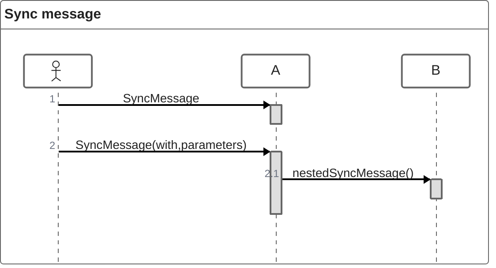
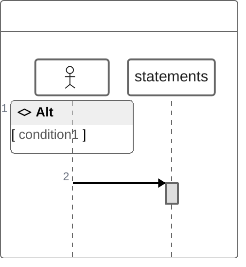

```mermaid

zenuml
    title Cloud's ABC Kludge
    @Actor Alice
    @BigQuery Bob
    @CloudStorage Clive
    @Database Dorothy
    Dorothy->Bob->Alice: **PROMPT*FOR*AUTH*
    Alice->Dorothy: *PRE*AUTH**

    Alice->Bob: SELECT * FROM...
    Bob->Dorothy: compiled SpQL
    Dorothy->Clive: Log
    Dorothy->Bob: ResultSet{}
    Bob->Alice: TABLE_ROW(s)

   
```

```mermaid

zenuml
    title Dumb Developer Team (DDT)
    @VirtualMachine Odin
    @VirtualMachine Thor
    @VirtualMachine Loki
    @VirtualMachine Balder
    @VirtualMachine Sif
    Sif->Odin: $deity.max(male, number)
    Sif->Thor: compile Chemistry_Life_SET
    Thor->Balder: Log(), Lock(), Knock()
    Thor->Odin: md(rot13(rot13(SECRET_PHRASE)))
    Thor->Sif: clear_screen

   
```

```mermaid
zenuml
    title Sync message
    A.SyncMessage
    A.SyncMessage(with, parameters) {
      B.nestedSyncMessage()
    }
```

```mermaid
zenuml
if(condition1) {
    ...statements...
} else if(condition2) {
    ...statements...
} else {
    ...statements...
}
```